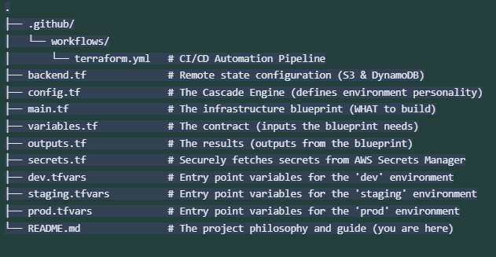

# terraform-architectural-patterns-aws
Implement Terraform workspaces for multiple environments (dev, staging, prod) in devops.

# Terraform for Multiple Environments: A Comparative Analysis

This project demonstrates and compares two powerful patterns for managing multiple environments (dev, staging, prod) with Terraform. It provides a complete, runnable implementation of the Workspace Pattern and contrasts it with the more scalable Directory/Module Pattern, offering a nuanced view of infrastructure-as-code architecture.

This repository is designed as a sophisticated portfolio piece, showcasing not just *how* to write Terraform, but *why* specific architectural choices are made.

## Pattern 1: The Workspace "Configuration Cascade" (Implemented Here)

This pattern uses a single set of Terraform files and leverages **Terraform Workspaces** to isolate state for each environment. The core of this pattern is the **"Configuration Cascade"**, a model for managing environment-specific settings.

### The Core Concept: Configuration as a Cascade

Instead of defining each environment's configuration from scratch, we establish layers. A `common` configuration defines the safe, default "DNA" of our infrastructure. Each environment (`dev`, `staging`, `prod`) then inherits from this base and applies only the specific overrides necessary for its purpose. This is analogous to how Cascading Style Sheets (CSS) work.

**Key Benefits of this Approach:**
*   **DRY (Don't Repeat Yourself):** Shared parameters (like common tags) are defined once.
*   **Lightweight:** For simple projects, maintaining a single set of `.tf` files is fast and easy.
*   **Safe by Default:** The `common` layer enforces safe defaults (e.g., small instance sizes), which must be consciously overridden for higher environments.

### Limitations of the Workspace Pattern

While elegant for simple use cases, this pattern has significant limitations in complex, production-grade systems:

*   **Provider & Backend Rigidity:** All workspaces share the same `backend.tf` and provider configuration. This means you cannot use different AWS roles, provider versions, or even state file locations for `dev` and `prod`, which is a major operational constraint.
*   **Difficulty with Structural Differences:** If `prod` needs a resource that `dev` does not (e.g., a database read replica), you must add complex `count` or `for_each` logic (`count = terraform.workspace == "prod" ? 1 : 0`) directly into your resource definitions. This pollutes the main blueprint and leads to configuration drift.
*   **Blast Radius:** A single mistake in `main.tf` can potentially impact all environments, as they all share the same core logic files.

## Pattern 2: The Directory/Module Pattern (Recommended for Scale)

For most production systems, a directory-based isolation model is superior. It provides stronger guarantees and greater flexibility.

**The Structure:**





**Key Benefits of this Approach:**
*   **True Isolation:** Each environment has its own state, provider configuration, and backend. You can safely test a new provider version in `dev` without any risk to `prod`.
*   **Clarity and Flexibility:** Structural differences are handled cleanly. The `prod/main.tf` can simply instantiate an extra module (e.g., for an RDS replica) that the `dev/main.tf` does not. No complex conditionals are needed.
*   **Reduced Blast Radius:** Changes can be applied to each environment directory independently, providing a clear promotion path from `dev` to `prod`.

**Conclusion:** The Workspace pattern is a useful tool for simple, homogenous environments. The Directory/Module pattern provides the isolation and flexibility required for complex, collaborative, production-grade systems. This repository implements the former while acknowledging the superiority of the latter for most real-world scenarios.

---

## Project Features

### CI/CD Automation with GitHub Actions

This repository includes a production-ready GitHub Actions workflow in `.github/workflows/terraform.yml`.
*   **Push to `dev` branch:** Automatically plans and applies changes to the `dev` environment.
*   **Push to `staging` branch:** Automatically plans and applies changes to the `staging` environment.
*   **Push to `main` branch:** Automatically plans and applies changes to the `prod` environment.
*   **Pull Request to `main`:** Runs a `terraform plan` to validate changes before merging.

**Setup:** You must configure `AWS_ACCESS_KEY_ID` and `AWS_SECRET_ACCESS_KEY` as repository secrets in GitHub for the workflow to authenticate with AWS.

### Secrets Management

**Anti-Pattern:** Never commit secrets or sensitive values to Git. The `.tfvars` files are for non-sensitive configuration only.

**Implemented Pattern:** This project uses a `data` source in `secrets.tf` to fetch secrets at runtime from **AWS Secrets Manager**. The secret's name is dynamically determined by the active workspace (e.g., `cascade-app/prod/db_credentials`), ensuring each environment uses its own isolated set of secrets.

---

## How to Use This Project

### Prerequisites
*   Terraform installed (`v1.0.0+`)
*   AWS account and AWS CLI configured with credentials.
*   An S3 bucket and a DynamoDB table for Terraform's remote state.
*   Secrets created in AWS Secrets Manager for each environment (e.g., `cascade-app/dev/db_credentials`).

### Manual Deployment (for Local Testing)

1.  **Configure Backend:**
    Update `backend.tf` with your unique S3 bucket and DynamoDB table names.

2.  **Initialize Terraform:**
    ```bash
    terraform init
    ```

3.  **Create and Select a Workspace:**
    ```bash
    terraform workspace new dev
    terraform workspace select dev
    ```

4.  **Deploy to an Environment:**
    Apply the configuration, providing the environment-specific variables file.
    ```bash
    terraform apply -var-file="dev.tfvars"
    ```
    To see the cascade in action, deploy to production:
    ```bash
    terraform workspace select prod
    terraform apply -var-file="prod.tfvars"
    ```

5.  **Destroy Infrastructure:**
    To tear down an environment, select the workspace and run `destroy`.
    ```bash
    terraform workspace select dev
    terraform destroy -var-file="dev.tfvars"
    ```
